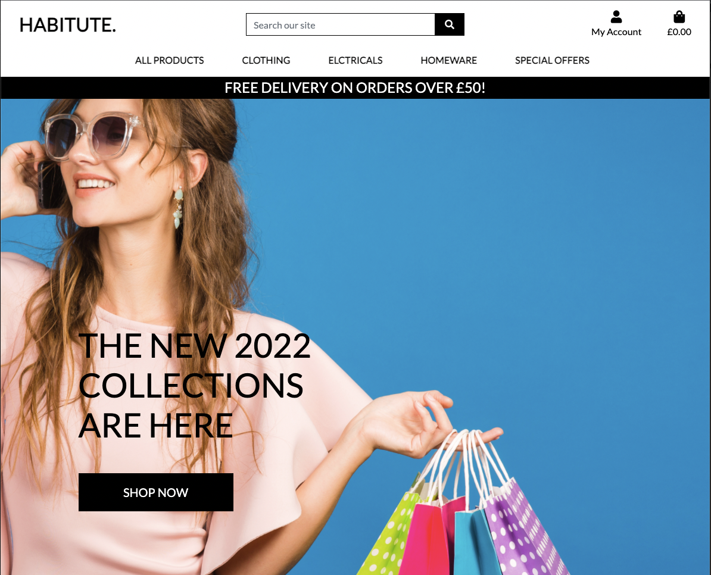

<h1 align="center">Habitute.</h1>


[View the live project here.](https://habitute-project.herokuapp.com/)

Habitute has been created as the fourth milestone project of my education as part of Code Institute's Full Stack Software Development course. Habitute is a virtual eCommerce website. It provides the user with a list of the various products available for purchase online. 

<h2 align="center"></h2>

## Table of contents
+ [User Experience](#User-Experience-(UX))
    + []()
    + []()
    + []()
    + []()
    + []()
+ []()
    + []()
    + []()
+ []()
    + []()
    + [Acknowledgements](#Acknowledgements)
## User Experience (UX)

Hatitute design ensures that the shopping experience is fast, easy, and as personalised as possible. This is the best way to engage users and boost those all-important checkouts.

### User stories


### Strategy

The design goal is to make a clear, accessible, structured site so that visitors can easily order products.

### Scope
The Habitute will have all the great design features of an eCommerce website. A straightforward navigation bar featuring main product categories prompts exploration. A service banner, placed under the header, immediately informs about shipping terms, a good practice for managing customer expectations.

### Structure
In designing the eCommerce website, I will conceptualise and arrange content and products for effective display and logic workflow. It should be easy to navigate the site on all screen sizes.

### Skeleton

I'm showing the mockup pages for the structure and how the site will appear on different screen pixels. The wireframes have been created using Balsamiq. 

- Desktop Wireframe - [View](https://github.com/PhilipWilliams0/habitute_ecom/tree/main/readme/wireframes)

The register link will disappear when logged in, and the login link will change to the account, where the dashboard, profile and logout link will be displayed. There will also be a product management link when you are logged as admin.

| Nav menu | Logged in User | Logged out User |
 --- | --- | ---
Home| &#9989; | &#9989; |
Products |&#9989; | &#9989; |
About us| &#9989; | &#9989; |
Contact | &#9989; | &#9989; |
Register| &#10060; | &#9989; |
Log in| &#10060; | &#9989; |
Account| &#9989; | &#10060; |
Dashboard| &#9989; | &#10060; |
Profile| &#9989; | &#10060; |
Log out| &#9989; | &#10060; |
Shopping bag | &#9989; | &#9989; |

Rights change when logged as admin:

| Options | Standard User Account | Admin User Account |
 --- | --- | ---
Add products | &#10060; | &#9989; |
Update products | &#10060; | &#9989; |
Delete products | &#10060; | &#9989; |
See other user orders | &#10060; | &#9989; |
Edit profile| &#9989; | &#9989; |

### Design

-   #### Colour Scheme
    -   The two main colours used 
-   #### Typography
    -   The Montserrat font is the main font used throughout the whole website with Sans Serif as the fallback font in case for any reason the font isn't being imported into the site correctly. Montserrat is a clean font used frequently in programming, so it is both attractive and appropriate.
-   #### Imagery
    -   Imagery is important. The large, background hero image is designed to be striking and catch the user's attention. It also has a modern, energetic aesthetic.


## Features
### Existing Features

The site contains the following features: 
-   Responsive on all device sizes

-   Interactive elements

### Features for the future

The following features can be added:

- informs about shipping terms and possible delays
## Technologies Used

### Languages Used

-   [HTML5](https://en.wikipedia.org/wiki/HTML5)
-   [CSS3](https://en.wikipedia.org/wiki/Cascading_Style_Sheets)
-   [Python](https://www.python.org/)
-   [JavaScript](https://www.javascript.com/)

### Frameworks, Libraries & Programs Used

1. [Postgres:](https://en.wikipedia.org/wiki/PostgreSQL)
    - Is a free and open-source relational database management system emphasizing extensibility and SQL compliance.
1. [Pillow:](https://pillow.readthedocs.io/en/stable/handbook/overview.html)
    - The Python Imaging Library adds image processing capabilities to your Python interpreter. This library provides extensive file format support, an efficient internal representation, and fairly powerful image processing capabilities.
1. [Bootstrap 4.6:](https://getbootstrap.com/docs/4.4/getting-started/introduction/)
    - Bootstrap was used to assist with the responsiveness and styling of the website.
1. [Stripe:](https://stripe.com/gb)
    - Stripe, Inc. Offers payment processing software and application programming interfaces for e-commerce websites and mobile applications.
1. [Font Awesome:](https://fontawesome.com/)
    - Font Awesome was used on all pages throughout the website to add icons for aesthetic and UX purposes.
1. [jQuery:](https://jquery.com/)
    - jQuery came with Bootstrap to make the navbar responsive but was also used for the smooth scroll function in JavaScript.
1. [Git](https://git-scm.com/)
    - Git was used for version control by utilizing the Gitpod terminal to commit to Git and Push to GitHub.
1. [GitHub:](https://github.com/)
    - GitHub is used to store the projects code after being pushed from Git.
1. [Balsamiq:](https://balsamiq.com/)
    - Balsamiq was used to create the [wireframes](https://github.com/) during the design process.

## Testing

The W3C Markup Validator and W3C CSS Validator Services were used to validate every page of the project to ensure there were no syntax errors in the project.

-   [W3C Markup Validator](https://jigsaw.w3.org/css-validator/#validate_by_input) 
    - [base.html]()
    - [base.html]()
    - [base.html]()
    - [base.html]()
    - [base.html]()
    - [base.html]()
    - [base.html]()
    - [base.html]()<br>
    

-   [W3C CSS Validator](https://jigsaw.w3.org/css-validator/#validate_by_input) 
    - [Results](https://github.com/)

### Testing User Stories from User Experience (UX) Section

-   #### First Time Visitor Goals

    1. As a First Time Visitor, I want to easily understand the main purpose of the site and learn more about the organisation.

        1. Upon entering the site, users are automatically greeted with a clean and easily readable navigation bar to go to the page of their choice. Underneath there is a Hero Image with Text and a "Learn More" Call to action button.
        2. The main points are made immediately with the hero image
        3. The user has two options, click the call to action buttons or scroll down, both of which will lead to the same place, to learn more about the organisation.

    2. As a First Time Visitor, I want to be able to easily be able to navigate throughout the site to find content.

        1. The site has been designed to be fluid and never to entrap the user. At the top of each page there is a clean navigation bar, each link describes what the page they will end up at clearly.
        2. At the bottom of the first 3 pages there is a redirection call to action to ensure the user always has somewhere to go and doesn't feel trapped as they get to the bottom of the page.
        3. On the Contact Us Page, after a form response is submitted, the page refreshes and the user is brought to the top of the page where the navigation bar is.

    3. As a First Time Visitor, I want to look for testimonials to understand what their users think of them and see if they are trusted. I also want to locate their social media links to see their following on social media to determine how trusted and known they are.
        1. Once the new visitor has read the About Us and What We Do text, they will notice the Why We are Loved So Much section.
        2. The user can also scroll to the bottom of any page on the site to locate social media links in the footer.
        3. At the bottom of the Contact Us page, the user is told underneath the form, that alternatively they can contact the organisation on social media which highlights the links to them.

-   #### Returning Visitor Goals

    1. As a Returning Visitor, I want to find the new programming challenges or hackathons.

        1. These are clearly shown in the banner message.
        2. They will be directed to a page with another hero image and call to action.

    2. As a Returning Visitor, I want to find the best way to get in contact with the organisation with any questions I may have.

        1. The navigation bar clearly highlights the "Contact Us" Page.
        2. Here they can fill out the form on the page or are told that alternatively they can message the organisation on social media.
        3. The footer contains links to the organisations Facebook, Twitter and Instagram page as well as the organization's email.
        4. Whichever link they click, it will be open up in a new tab to ensure the user can easily get back to the website.
        5. The email button is set up to automatically open up your email app and autofill there email address in the "To" section.

    3. As a Returning Visitor, I want to find the Facebook Group link so that I can join and interact with others in the community.
        1. The Facebook Page can be found at the footer of every page and will open a new tab for the user and more information can be found on the Facebook page.
        2. Alternatively, the user can scroll to the bottom of the Home page to find the Facebook Group redirect card and can easily join by clicking the "Join Now!" button which like any external link, will open in a new tab to ensure they can get back to the website easily.
        3. If the user is on the "Our Favourites" page they will also be greeted with a call to action button to invite the user to the Facebook group. The user is incentivized as they are told there is a weekly favourite product posted in the group.

-   #### Frequent User Goals

    1. As a Frequent User, I want to check to see if there are any newly added challenges or hackathons.

        1. The user would already be comfortable with the website layout and can easily click the banner message.

    2. As a Frequent User, I want to check to see if there are any new blog posts.

        1. The user would already be comfortable with the website layout and can easily click the blog link

    3. As a Frequent User, I want to sign up to the Newsletter so that I am emailed any major updates and/or changes to the website or organisation.
        1. At the bottom of every page their is a footer which content is consistent throughout all pages.
        2. To the right hand side of the footer the user can see "Subscribe to our Newsletter" and are prompted to Enter their email address.
        3. There is a "Submit" button to the right hand side of the input field which is located close to the field and can easily be distinguished.

### Further Testing

-   The Website was tested on Google Chrome, Internet Explorer, Microsoft Edge and Safari browsers.
-   The website was viewed on a variety of devices such as Desktop, Laptop, iPhone7, iPhone 8 & iPhoneX.
-   A large amount of testing was done to ensure that all pages were linking correctly.
-   Friends and family members were asked to review the site and documentation to point out any bugs and/or user experience issues.

### Known Bugs

-   Categories are not appearing at the top of products pages
-   Stripe payment are unsucessful and keep failing. 
-   Checkout Success is niot showing delivery and cost charges, works in test but not in deployment.
-   500 error when completing a payment if not logged in. 
-   500 error when completing a contact request if not logged in. 


## Deployment

### GitHub Pages

The project was deployed to GitHub Pages using the following steps...

1. Log in to GitHub and locate the [GitHub Repository](https://github.com/PhilipWilliams0/habitute_ecom)
2. At the top of the Repository (not top of page), locate the "Settings" Button on the menu.
    - Alternatively Click [Here](https://raw.githubusercontent.com/) for a GIF demonstrating the process starting from Step 2.
3. Scroll down the Settings page until you locate the "GitHub Pages" Section.
4. Under "Source", click the dropdown called "None" and select "Master Branch".
5. The page will automatically refresh.
6. Scroll back down through the page to locate the now published site [link](https://github.com) in the "GitHub Pages" section.

### Forking the GitHub Repository

By forking the GitHub Repository we make a copy of the original repository on our GitHub account to view and/or make changes without affecting the original repository by using the following steps...

1. Log in to GitHub and locate the [GitHub Repository](https://github.com/)
2. At the top of the Repository (not top of page) just above the "Settings" Button on the menu, locate the "Fork" Button.
3. You should now have a copy of the original repository in your GitHub account.

### Making a Local Clone

1. Log in to GitHub and locate the [GitHub Repository](https://github.com/)
2. Under the repository name, click "Clone or download".
3. To clone the repository using HTTPS, under "Clone with HTTPS", copy the link.
4. Open Git Bash
5. Change the current working directory to the location where you want the cloned directory to be made.
6. Type `git clone`, and then paste the URL you copied in Step 3.

```
$ git clone https://github.com/YOUR-USERNAME/YOUR-REPOSITORY
```

7. Press Enter. Your local clone will be created.

```
$ git clone https://github.com/YOUR-USERNAME/YOUR-REPOSITORY
> Cloning into `CI-Clone`...
> remote: Counting objects: 10, done.
> remote: Compressing objects: 100% (8/8), done.
> remove: Total 10 (delta 1), reused 10 (delta 1)
> Unpacking objects: 100% (10/10), done.
```

Click [Here](https://help.github.com/en/github/creating-cloning-and-archiving-repositories/cloning-a-repository#cloning-a-repository-to-github-desktop) to retrieve pictures for some of the buttons and more detailed explanations of the above process.

### Virtual Environment

1. Set up a virtual environment with these commands in the terminal session:
```
pip3 install virtualenv
```
>If you already have virtualenv installed from a different project, then this step is not needed. The pip command may differ per system this can be pip or pip3.
```
virtualenv env
```
>The needed command may differ to the IDE you are using, such as `python -m .venv venv ...` or `py manage.py` ...

Activate the .env with the command:
```
env\Scripts\activate
```
>This command may differ depending on your operating system, please check the Python documentation on creating an ENV.
2. Install all required django modules with the command:
```
pip3 install -r requirements.txt
```
3. Create a new env.py file at the base directory level and copy the following into the created env.py file:
```
import os

#Django
os.environ.setdefault( 'DEVELOPMENT', 'True')
os.environ.setdefault('SECRET_KEY', 'your_value')

#Stripe
os.environ.setdefault('STRIPE_PUBLIC_KEY', 'your_value')
os.environ.setdefault('STRIPE_SECRET_KEY', 'your_value')
```
Replace `your_value` with the values from your own created accounts for stripe and a [Django Secret Key Generator](https://miniwebtool.com/django-secret-key-generator/):
- [STRIPE_PUBLIC_KEY](https://dashboard.stripe.com/test/apikeys)
- [STRIPE_SECRET_KEY](https://dashboard.stripe.com/test/apikeys)
- [SECRET_KEY](https://miniwebtool.com/django-secret-key-generator/)
4. Set up your database by running the following command in your terminal:
```
python3 manage.py makemigrations
```
Followed by:
```
python3 manage.py migrate
```
5. Now create a superuser to get access to the Django admin, use the following command:
```
python3 manage.py createsuperuser
```
6. Now we need to add the required data into the database in the following order by using the following commands:
```
python3 manage.py loaddata categories
python3 manage.py loaddata printingmethod
python3 manage.py loaddata size
python3 manage.py loaddata producttag
python3 manage.py loaddata products
```
7. At this point you can start your server with the following command:
```
python3 manage.py runserver
```
If everything went correctly you should see something like this in the terminal:<br>
 <br>

### Heroku
To create a live version of the website VSCode was used together with Heroku. This section assumes you have succeeded at running the application in your local environment first, as described above. 
To deploy the website with Heroku the following steps were made:
1. Log in or create an account on [Heroku](https://www.heroku.com) and create a new app by clicking the button.<br>
 <br>
2. Give the app a unique name in all lowercase letters and set `Choose a region` to the one nearest to you (in this case Europ and 
postfly_jouw_online_drukkerij is already taken so think of another name), click on create app.<br>
 <br>
3. On your app dashboard click `Deploy` and select `GitHub`, connect it to your GitHub respository. Don't click `Enable Automatic Deploys` yet.<br>
 <br>
4. Click on the `Resources` tab and type `Heroku Postgres` in the `Add-ons` field, select the `Hobby Dev` option.
 <br>
5. Click on `Settings` and then `Reveal Config Vars`. <br>
 <br>
6. Fill in the values from your `env.py` file in your Heroku confic vars: <br>

| Key | Value |
 --- | ---
DATABASE_URL | `your_DATABASE_URL`
SECRET_KEY | `your_SECRET_KEY`
STRIPE_PUBLIC_KEY | `your_STRIPE_PUBLIC_KEY`
STRIPE_SECRET_KEY | `your_STRIPE_SECRET_KEY`

The DATABASE_URL link which can be found in Heroku's Config Vars.<br>
7. Since the database on Heroku is created you need to adjust your `env.py` file, add:
```
os.environ.setdefault('DATABASE_URL', '<your postgres url grabbed from Heroku comes here>')
```
>Make sure not to share this link with anybody.
8. Now we need to migrate the new database connection with:
```
python3 manage.py makemigrations
```
Followed by:
```
python3 manage.py migrate
```
>Do not forget to reactivate your virtual environment if the system or IDE is rebooted.
9. Create a superuser to get access to the Django admin, use the following command:
```
python3 manage.py createsuperuser
```
10. Now we need to add the required data into the database in the following order by using the following commands:
```
python3 manage.py loaddata categories
python3 manage.py loaddata printingmethod
python3 manage.py loaddata size
python3 manage.py loaddata producttag
python3 manage.py loaddata products
```
11. Install Heroku in the terminal, if you don't have that 
yet see how to do that [here](https://devcenter.heroku.com/articles/heroku-cli) and log in with the command: 
```
heroku login
```
12. Then use the command:
```
heroku config:set DISABLE_COLLECTSTATIC=1 --app habitute
```
so that Heroku will not try to collect static during deployment.

13. After everything is set up as it should use the following commands to push to GitHub and Heroku:
```
git add .
git commit -m "Place your own commit message here"
git push
heroku git: remote -a your heroku git url
git push heroku main
```
You will then see something like this in your terminal:
 <br>

14. If you want you can let the deployment to Heroku be automatically everytime you push to GitHub, on your app dashboard click `Deploy` and click `Enable Automatic Deploys`.
If you go to the `Activity` tab on your app dashboard you can see that there is a build in progress, the details will look a bit like this:
 <br>
Your app is running on Heroku now.

15. Log in to the admin panel by placing /admin behind your app name, for example for this one: https://habitute.herokuapp.com/admin
Using the superuser log in details log in.

>!!! If you don't see your email address you may need to attempt to log in first to force allauth to create it !!!

Go to `Email addresses` underneath `ACCOUNTS`, and mark `Primary` and `Verified` for the superuser email address, save the changes you made.

### Set up Amazon AWS

To follow the next steps make sure you have an Amazon AWS account and that you are logged in.

#### S3 Bucket

1. In the AWS Management Console search for S3, open it and click `Create bucket`<br>
 <br>
2. Name your bucket to match your Heroku app name and select the region closest to you. Uncheck `Block all public access` and acknowledge that the bucket will be public.
Click `Create bucket`.
 <br>
3. Click your newly made bucket and cick the `Properties` tab and turn on `Static website hosting`, just fill in a default value for the index and error document and click save.
4. Now click on the `Permissions` tab, with the Cross-origin resource sharing (CORS) fill in:
```
[
    {
        "AllowedHeaders": [
            "Authorization"
        ],
        "AllowedMethods": [
            "GET"
        ],
        "AllowedOrigins": [
            "*"
        ],
        "ExposeHeaders": []
    }
]
```
Save the changes. <br>

5. Go to `Bucket Policy` and click `Policy generator`, fill it out like this, but with your own arn.<br>
 <br>

6. Copy the policy that you get and paste it in the `Bucket policy`, in tis case:
```
{
    "Version": "2012-10-17",
    "Id": "Policy1635688080273",
    "Statement": [
        {
            "Sid": "Stmt1635688076687",
            "Effect": "Allow",
            "Principal": "*",
            "Action": "s3:GetObject",
            "Resource": "arn:aws:s3:::postfly-jouw-online-drukkerij/*"
        }
    ]
}
```
Make sure you add the /* with the resource key to allow acces to all resources in this bucket. Click save.<br>
7. Go to the `Access control list (ACL)` tab and set the list projects permission for everyone under the `Public Access` section.


#### IAM

1. In the AWS Management Console search for IAM, open it.
2. On the IAM dashboard click `User groups` and then `Create group`, name your group so it makes sense to you what it is. Click `Create group`.
3. On the menu left click `Policies` and then `Create Policy`.
4. Click on the `Json` tab and click `Import managed policy`, search for `S3` select the `AmazonS3FullAccess` one. Click import.
 <br>
5. You just want to give permission to your bucket, so make sure you fill it out like this, but with your own arn! 
 <br>
Click next untill you reach `ReviewPolicy`
6. Give it an name and a description and click `Create policy`.
7. You'll arrive back on the policy page, go to `User groups` in the menu on the left and click on manage-your-group-name.
8. Click `Attach policies` search for and select the policy you just created.
 <br>
9. Click on `Users` in the menu on the left. Then click `Add users` name it after your app, in my case postfly-jouw-online-drukkerij-staticfiles-user, give programmatic access and select next. Add the user to the group you just created. Click through on next and then on create user.
10. Download the csv file you see there and save it!
You need the secrect keys in there and once you've done this there is now way to retrieve it!!<br>
 <br>

#### Connecting AWS to Django

This section assumes you have succeeded at running this application in your local environment first, deployed it to Heroku and set up AWS as described above.

1. Remove the DISABLE_COLLECTSTATIC variable from your `Config Vars` on Heroku and add these values to it:

| Key | Value |
 --- | ---
AWS_ACCESS_KEY_ID | `your_AWS_ACCESS_KEY_ID`
AWS_SECRET_ACCESS_KEY | `your_AWS_SECRET_ACCESS_KEY`
USE_AWS | True

The values you'll find in the downloaded csv file.
Next time you deploy to Heroku, AWS will retrieve your static files and store them.

2. Go to S3, where you'll find a `static` folder with all your static files in it.
3. Click on `Create folder` and name it `media` click save and inside the media folder click `Upload`.
4. Click `Add files` and select the images that go with your products or in this case with the size.
5. Click next and under `Manage public permissions`, and choose `Grant public-read access`.
6. Then click`Upload`, you will see your files being uploaded.<br>
 <br>

### Sending real emails with Gmail

1. Create or use an existing Gmail account.
2. Connect it to your application to the Gmail account. For more information see for example this [site](https://dev.to/abderrahmanemustapha/how-to-send-email-with-django-and-gmail-in-production-the-right-way-24ab) and read `The Gmail part`.
3. Add the values to the Heroku Config Vars:

| Key | Value |
 --- | ---
EMAIL_HOST_PASS | `your_EMAIL_HOST_PASS`
EMAIL_HOST_USER | `your_EMAIL_HOST_USER`

Everything should be ready to go now.

## Credits

### Code

-   Code Institue boutique-ado project for setup and linking to AWS, supplied the bulk of the tutorials, resources and support for this project. 

-   [Bootstrap4](https://getbootstrap.com/docs/4.4/getting-started/introduction/): Bootstrap Library used throughout the project mainly to make site responsive using the Bootstrap Grid System.

-   [MDN Web Docs](https://developer.mozilla.org/) : For Pattern Validation code. Code was modified to better fit my needs and to match an Irish phone number layout to ensure correct validation. Tutorial Found [Here](https://developer.mozilla.org/en-US/docs/Web/HTML/Element/input/tel#Pattern_validation)

### Content

-   All content was written by the developer.

-   Psychological properties of colours text in the README.md was found [here](http://www.colour-affects.co.uk/psychological-properties-of-colours)

### Media

-   iphone product image - Photo by cottonbro from Pexels
-   xbox controller image - Photo by simon-trappe from Pexels

### Acknowledgements

-   My Mentor for continuous helpful feedback.

-   Tutor support at Code Institute for their support.

***
[back to top](#Table-of-contents)